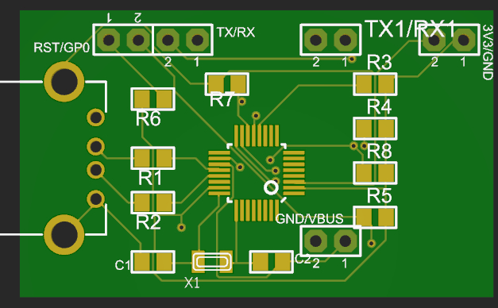
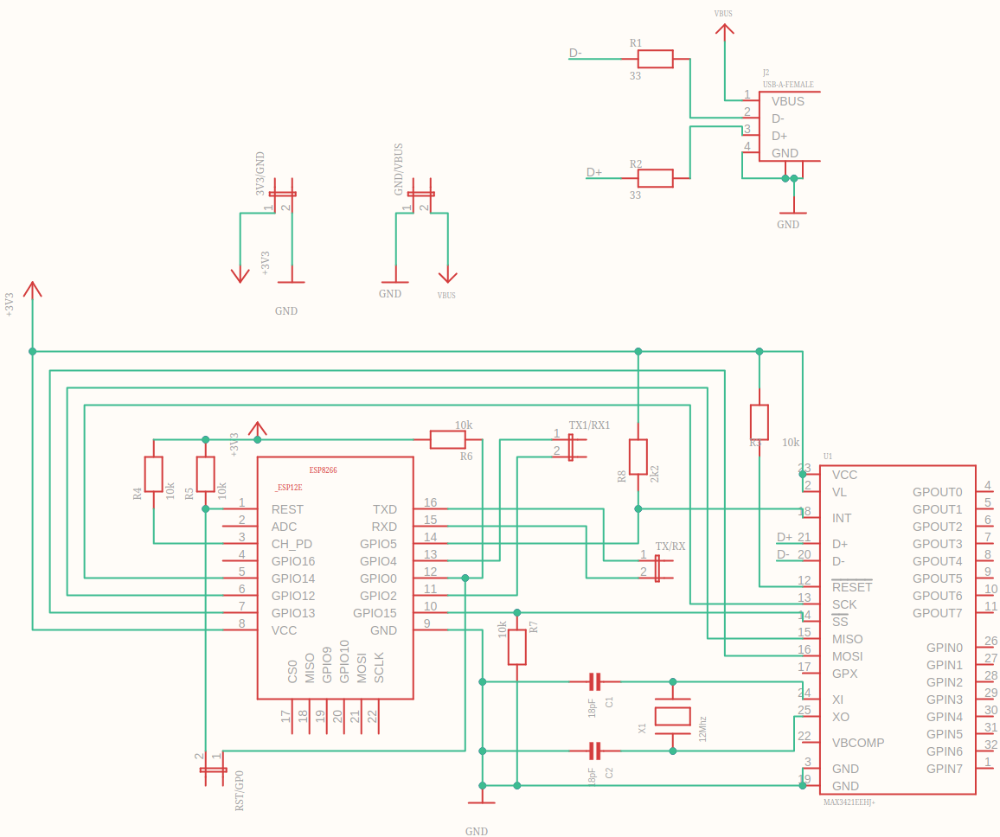
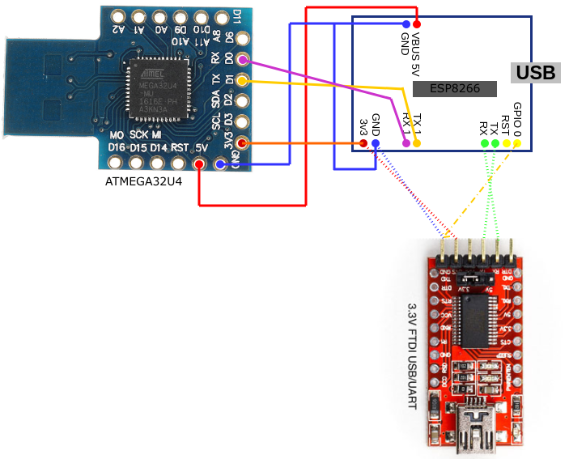

# UberHid

Wifi keylogger with keyboard and mouse injection capabilities

*in the firmware directory resides the firmware for the ATmega32u4 and ESP8266 (ESP-12)

*in the hardware directory resides the schematics (I used Eagle)


## Bill of Materials

| Qty. | Description            | Obs.                                                            |
|------|------------------------|-----------------------------------------------------------------|
| 1    | UBERHid PCB            |    Designed by [@kripthor](https://github.com/kripthor/UberHid/)                                                             |
| 1    | Arduino atmega32u4     | Board is designed for DM Micro AU version (Beetle with 18 pins) |
| 1    | ESP8266 ESP-12E module | Chip only. To solder.                                           |
| 5    | 10kΩ Resistor          | SMD.                                                            |
| 2    | 33Ω Resistor           | SMD.                                                            |
| 2    | 18pF Capacitator       | SMD.                                                            |
| 1    | XTAL TXC 12Mhz         | SMD.                                                            |
| 1    | 2k2 Resistor           | 2.2KΩ SMD.                                                      |
|   1  |       FTDI FT232RL    |   USB to TTL Serial 3.3V/5V USB Adapter or equivalent, only used to program the ESP8266.                                                    |

## Schematics







## How to build/deploy

### Using [Platformio](https://platformio.org/)

#### ESP8266
0. Connect the FTDI to the PCB pins as depicted in the wiring scheme above.
1. Uncomment the follwing lines in ```platformio.ini```:
```yaml
src_dir = ${workspacedir}/firmware/UberHID-ESPUSB/.
data_dir = ${workspacedir}/firmware/UberHID-ESPUSB/data
```
2. ```$ platformio run -e esp12e``` _sanity check_
3. ```$ platformio run -e esp12e --target upload --upload-port <dev/ttyUSB*>```
    - Replace ```<dev/ttyUSB*>``` with your device, _e.g._: ```dev/ttyUSB0```

#### Arduino Leonardo (atmega32u4)

0. Plug-in the Arduino Leonardo in one of the computer USB ports.
1. Uncomment the follwing line in ```platformio.ini```:
```yaml
src_dir = ${workspacedir}/firmware/UberHID-Leonardo/.
```
2. ```$ platformio run -e leonardo``` _sanity check_
3. ```$ platformio run -e leonardo --target upload --upload-port <dev/ttyACM*>```
    - Replace ```<dev/ttyACM*>``` with your device, _e.g._: ```dev/ttyACM0```