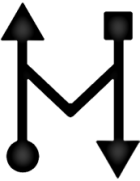
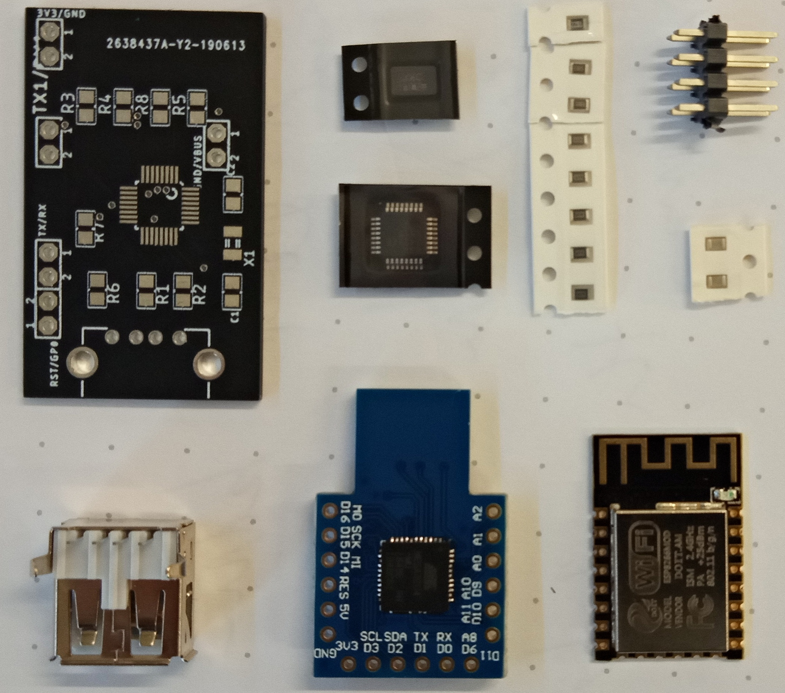
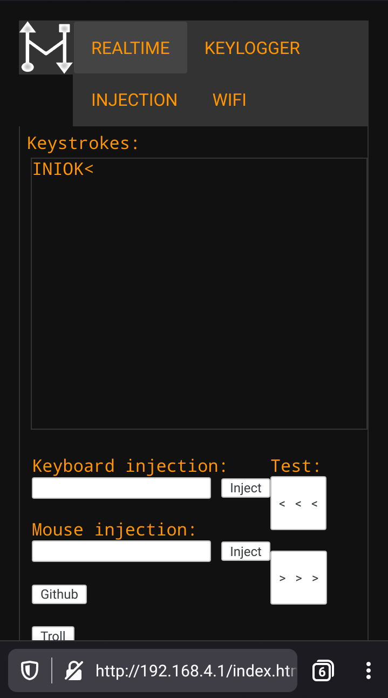

# UberHid



Wifi keylogger with keyboard and mouse injection capabilities.

```bash
├── docs # docs and pictures
├── firmware # firmware code
│ ├── UberHID-ESPUSB # ESP8266 firmware
│ │ └── data # ESP8266 static files
│ └── UberHID-Leonardo # ATmega32u4 firmware
└── hardware # hardware schematics
```

## Bill of Materials

| Qty. | Description | Obs. |
|------|------------------------|-----------------------------------------------------------------|
| 1 | UBERHid PCB | Designed by [@kripthor](https://github.com/kripthor/UberHid/) |
| 1 | Arduino atmega32u4 | Board is designed for DM Micro AU version (Beetle with 18 pins) |
| 1 | ESP8266 ESP-12E module | Module to solder |
| 1 | MAX3421EEHJ+ USB | USB Peripheral Host Controller 32-Pin |
| 5 | 10kΩ Resistor | SMD. |
| 2 | 33Ω Resistor | SMD. |
| 2 | 18pF Capacitator | SMD. |
| 1 | XTAL TXC 12Mhz | SMD. |
| 1 | 2k2 Resistor | 2.2KΩ SMD. |
| 1 | FTDI FT232RL | USB to TTL Serial 3.3V/5V USB Adapter or equivalent. Used to program the ESP8266. |



* All the components can be found in the usual online stores such as *Aliexpress* and *eBay*.

## Schematics

### UBERHid PCB


### UBERHid Schematic


### UBERHid Wiring 

Details of the wiring between the ATmega32u4 and FTDI programmer. Note that the ATmega used in this case was an SS Micro version which does not have the same pinout as the recommended DM Micro AU Beetle Leonardo, which fits directly in the PCB pinout layout.


## Soldering

The components must be soldered accordingly to the above schematic. Some extra details and _protips_:

- Start by sodering the smaller components, especially the MAX3421 chip, the SMD resistors and capacitors and the XTAL crystal.
- Two pins stay right bellow the ESP8266 chip. You have to be sure that these pins do not make any contact with the ESP8266 after the soldering is completed. I used a little of heat-resistant isolator tape to avoid any contact and soldered the pins on the other side of the board.
- Solder the ESP8266 before the remaining pinouts to have more space. 
- Finish the soldering by adding the remaining pins and the USB port.
- The atmega32u4 can be soldered directly on top of the UBERHid PCB, although some jumper cables can also be used to make it possible to reuse it to other projects.
- Clean the board using isopropyl alcohol.

## How to program the devices

### Using [Platformio](https://platformio.org/)

#### ESP8266

0. Connect the FTDI to the PCB pins as depicted in the wiring scheme above.
1. GPIO0 is needs to be grounded to get into programming mode.
2. Uncomment the follwing lines in ```platformio.ini```:
```yaml
src_dir = ${workspacedir}/firmware/UberHID-ESPUSB/.
data_dir = ${workspacedir}/firmware/UberHID-ESPUSB/data/.
```
3. ```$ platformio run -e esp12e``` _sanity check_
4. ```$ platformio run -e esp12e --target upload --upload-port <dev/ttyUSB*>``` _uploads firmware_
 - Replace ```<dev/ttyUSB*>``` with your device, _e.g._: ```dev/ttyUSB0```
5. ```$ pio run -e esp12e --target uploadfs --upload-port <dev/ttyUSB*>``` _uploads filesystem (data folder)_
 - Replace ```<dev/ttyUSB*>``` with your device, _e.g._: ```dev/ttyUSB0```

#### Arduino Leonardo (atmega32u4)

0. Plug-in the Arduino Leonardo in one of the computer USB ports.
1. Uncomment the follwing line in ```platformio.ini```:
```yaml
src_dir = ${workspacedir}/firmware/UberHID-Leonardo/.
```
2. ```$ platformio run -e leonardo``` _sanity check_
3. ```$ platformio run -e leonardo --target upload --upload-port <dev/ttyACM*>```
 - Replace ```<dev/ttyACM*>``` with your device, _e.g._: ```dev/ttyACM0```


## How to use it?

0. Connect the device between a keyboard and a computer. 
 ```
 ----------     ---------     ----------
 |Keyboard| <-> |UBERHid| <-> |Computer|
 ----------     ---------     ----------
 ```
1. Connect to the device access point.
 - It can be visible or hidden depending on the configuration on file ```Config.h``` in ```firmware/UberHID-ESPUSB```. Other configurations available are the access point name and password.

 ```C
 #define WIFISSID "UBERHID"
 #define WIFIPASS "uberidiota"
 #define WIFICHANNEL 7
 #define WIFISSIDHIDDEN 0 // 0 for not hidden
 ``` 
2. Navigate to ```192.168.4.1```



3. You can see the keystrokes in realtime and inject keyboard and mouse commands. Also, you can RickRoll your friends.
